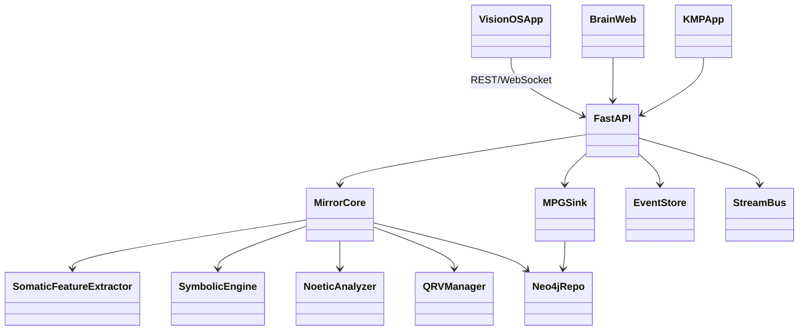
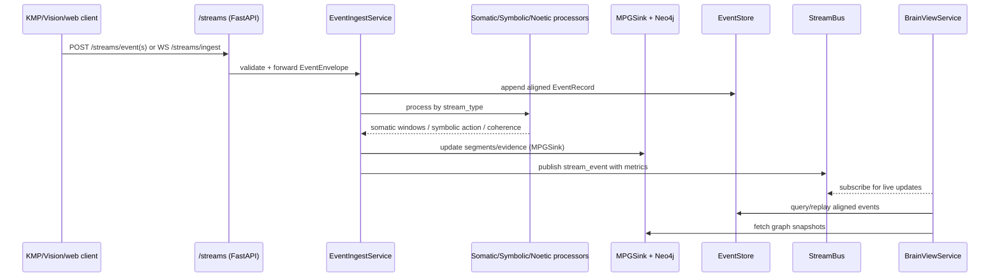
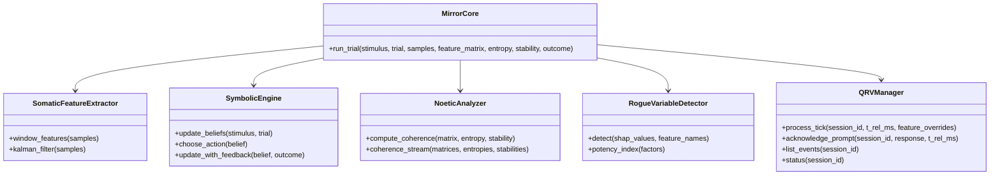
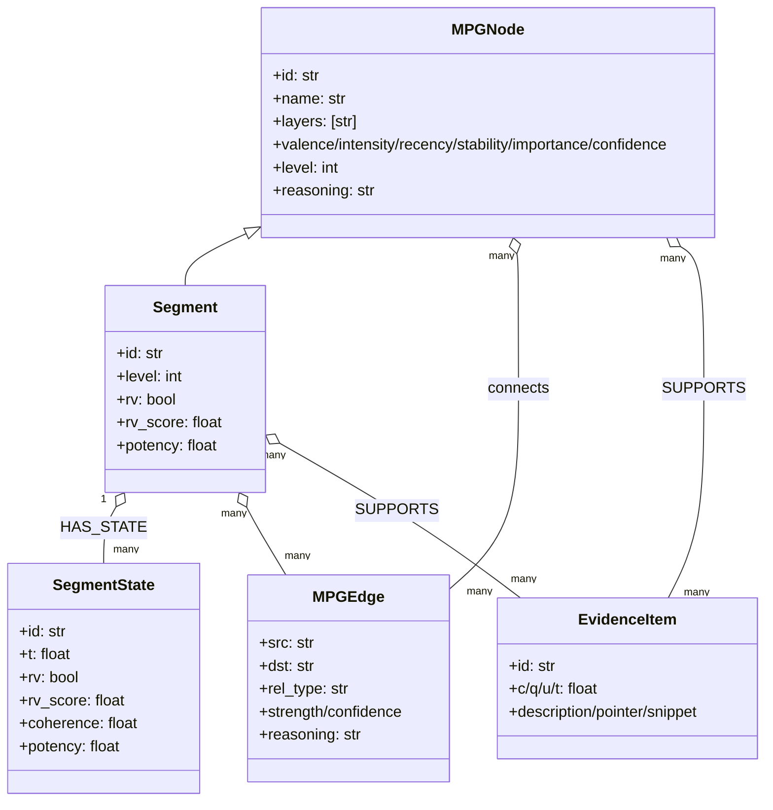
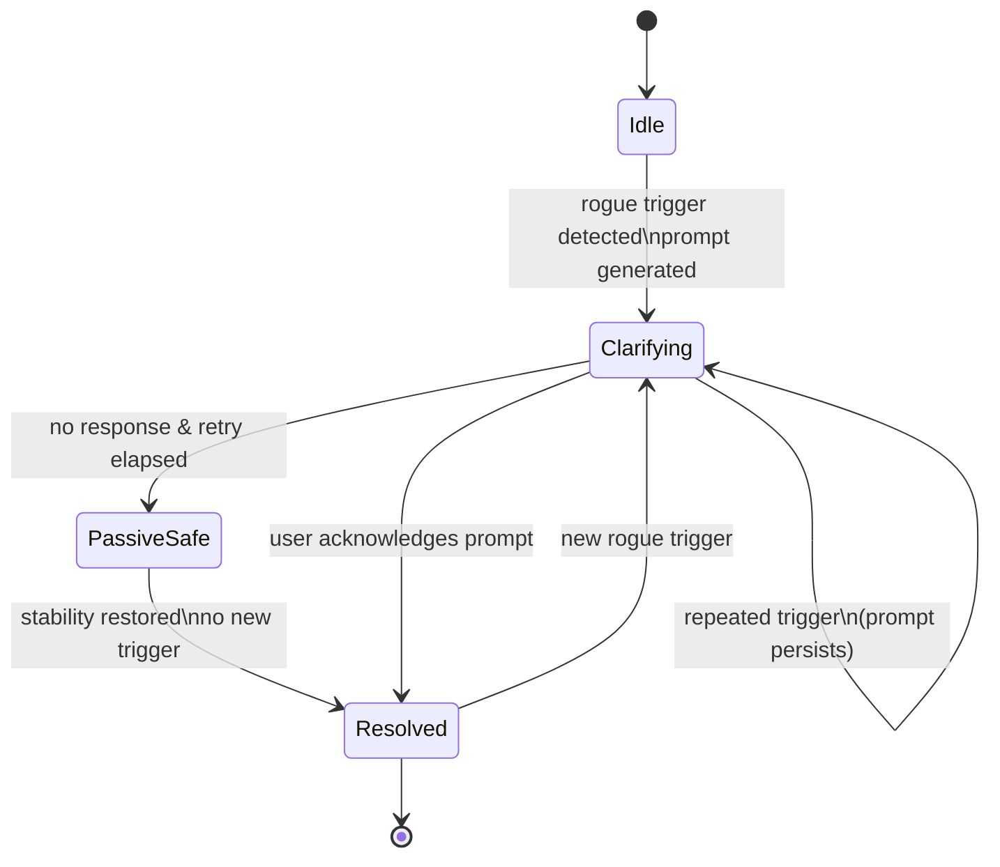

# H3LIX Architecture Guide

This document expands the architecture description for the LAIZA / H3LIX stack using the current codebase and the full set of change requests (CR-001 through CR-436) as input. It ties the Somatic–Symbolic–Noetic loop, MPG graph stack, Rogue Variable flows, streaming telemetry, and client surfaces together, with Mermaid UML diagrams for quick scanning. Rationale for each slice is pulled from the design spine in `BLUEPRINT.md`, the CR series, and the paper-aligned specs in `docs/CR-001..004.md` (MPG/RV/MUFS), `docs/CR-005.md` (human loop), `docs/CR-302.md` (schemas), and `docs/CR-436-Quantum-Rogue-Variable-Layer.md` (QRV/HILD/RVL/RSL).

## Design rationale (why it is structured this way)
- **Explicit Somatic–Symbolic–Noetic loop**: Mirror Core is kept thin and composable so it mirrors the SORK-N loop in `CR-005.md` and the layer separation in `BLUEPRINT.md`; this lets Somatic preprocessing swap between lab and edge sensors (CR-101/102) without touching Symbolic/Noetic math.
- **Graph-first memory (MPG)**: Neo4j + NetworkX reflect the Layer-Type Graph definitions in `CR-001.md` and the lift/segmentation pipeline in `CR-003.md`. It preserves provenance (`EvidenceItem`) as required by governance notes in `docs/ETHICS_PRIVACY.md` and CR-008 meta-policy safeguards.
- **Streaming before storage**: `streams/` enforces consent and clock alignment before data hits Neo4j or Timescale (CR-005, CR-302), so every downstream consumer (console, clinical mode, viewers) trusts the same aligned envelope and scopes.
- **Two rogue paths (classical + quantum-inspired)**: Classic SHAP/3σ (CR-002) sits beside QRV spectral detection (CR-436). QRV is optional but shares repo/query surfaces so front-ends can light up both without branching UX.
- **Human-in-the-loop safety**: HILD state machine is wired through `QRVManager` to satisfy CR-436’s “autonomy suspension + clarifying prompt + passive safe” requirements, reflecting the cautious stance in `docs/ETHICS_PRIVACY.md` and clinical constraints in `CR-106.md`.
- **APIs as contracts, not GUIs**: Every surface (participant cockpit, console, clinical, teaching mode) is a router on top of the same typed models (CR-302/303). This keeps the teaching/collab modes (CR-435/411) consistent with production telemetry.
- **Visualization-first layouts**: `brain/layout.py` produces stable coordinates and color semantics so viewers across `brain-web` and `vision/H3LIXVision` match the visual grammar proposed in CR-401/407/416/420. Stable layout seeds make replay sessions comparable, as required by CR-009/010 benchmarks.

## System overview
- **Mirror Core (`core/mirror.py`)** orchestrates the Somatic (`somatic/processor.py`), Symbolic (`symbolic/belief.py`), and Noetic (`noetic/coherence.py`) layers, runs trials, computes coherence, and triggers Rogue Variable checks (classic and quantum-inspired).
- **MPG graph layer (`mpg/`)** stores Layer-Type Graph nodes, segments, evidence, and temporal `SegmentState` snapshots in Neo4j or in-memory stores; segmentation and lift live in `mpg/segmentation.py`.
- **Streaming pipeline (`streams/`)** ingests human telemetry over REST/WebSocket, aligns clocks, enforces consent scopes, feeds Somatic/Symbolic/Noetic processors, and writes events to in-memory or Postgres/Timescale stores with an optional WebSocket `StreamBus`.
- **Quantum Rogue Variable Module (QRVM, `core/qrv/`)** implements QMS encoding, Hamiltonian prediction, spectral rogue detection, Human-in-the-Loop Decoherence (HILD), Rogue Variable Library (RVL), and Rosetta Stone alignment.
- **APIs (`api/main.py` + routers)** expose participant cockpit, console/clinical, mobile, visualization, benchmark hub, policy/meta-policy, QRV, synthetic generator, and telemetry ingest endpoints.
- **Clients and surfaces**: `brain-web/` (web brain viewer), `vision/H3LIXVision/` (visionOS RealityKit app), `kmp/` (Kotlin multiplatform edge app), plus experiments (`experiments/`, `scripts/`) and connectors (`connectors/`, `services/`).

## Codebase map (high touch points)
- `core/`: Mirror orchestrator, shared models, QRV manager.
- `somatic/`, `symbolic/`, `noetic/`: Layer-specific processing and metrics.
- `mpg/`: Graph models, repositories (Neo4j + in-memory), segmentation, protocol state helpers.
- `streams/`: Event envelopes, ingest service, processors, consent scopes, event stores, stream bus.
- `api/`: FastAPI routers for streams, visualization, console/clinical, participant cockpit, mobile, policies/meta-policies, protocols, QRV, benchmark hub, cohorts/lessons, LLM router.
- `services/`: Preference store, protocol personalization, LLM backends (Apple local, remote vLLM, native sidecar).
- `brain/`: Graph snapshot builder and layouts for viewer clients.
- `brain-web/`, `vision/H3LIXVision/`, `kmp/`: Viewer/UX implementations across web and visionOS/mobile.
- `docs/`: Change requests, ethics/privacy, experiments, benchmark hub guidance.

## Runtime flows
- **Streaming ingest (CR-005, CR-101/102/104, CR-302/303)**: External clients send `EventEnvelope` or batches to `/streams/event(s)` or `/streams/ingest` (WebSocket). `EventIngestService` aligns timestamps (`TimeAligner`), enforces scopes (`ConsentManager`), stores events, dispatches processors (Somatic/Symbolic/Noetic), updates MPG via `MPGSink`, and publishes summaries on `StreamBus`. This “align then derive” order is straight from `CR-302.md` to keep Noetic coherence and MUFS reproducible across runs, and to respect consent gating from `CR-005.md`.
- **Trial and MPG loop (CR-001..004, CR-302)**: `MirrorCore.run_trial` windows somatic signals, filters via Kalman, updates Symbolic beliefs/actions, writes outcomes, computes Noetic coherence, flags Rogue Variables, and optionally runs QRV detection for a session. This mirrors the Def. 1–8 pipeline in the MPG/Intuition change requests so experiments in `configs/` match the theory in `CR-004-MUFS-and-MPG-Intuition.md`.
- **Quantum rogue detection (CR-436)**: `QRVManager` builds a Quantum MPG State (QMS) from top segments, predicts next state via Hamiltonian, detects spectral anomalies, runs ablation checks, logs events in RVL, and drives `HILDStateMachine` for human-in-the-loop prompts and safety. The dual predicted/observed paths match the “error operator + ablation test” design in `docs/CR-436-Quantum-Rogue-Variable-Layer.md` and keep the human clarification loop auditable.
- **Policies and interventions (CR-007, CR-008, CR-106/107/108)**: Policy/meta-policy routers expose CRUD over policy episodes, personalization (`services/personalization.py`), protocol templates, and clinician-guided mode hooks. The separation keeps governance and meta-policy adjustments (CR-008) orthogonal to clinical guidance (CR-106/107) so safety reviews do not block experimentation.
- **Visualization and replay (CR-009/010/011, CR-302/303, CR-401/407/411/416/420/435)**: `brain-web` and `vision/H3LIXVision` consume visualization API (`api/visualization_api.py`) and brain snapshots (`api/brain_api.py`), leveraging StreamBus live data and event-store replay. Stable snapshot/replay contracts are mandated by the benchmark reproducibility goals in `CR-009-Benchmarking-and-Ablations.md` and the teaching/collab modes in `CR-435.md` and `CR-411.md`.

## Storage and data contracts
- **Neo4j**: Primary store for `:MPGNode`, `:Segment`, `:SegmentState`, evidence, protocols, trials, policies, and QRV records. Confidence and potency computed via repository helpers; queries exposed through API routers. A graph store is chosen to stay faithful to the Layer-Type Graph math in `CR-001.md` and the governance/provenance needs in `CR-008.md` and `docs/ETHICS_PRIVACY.md`.
- **Event store**: In-memory by default; Postgres/Timescale via `EVENT_STORE_DSN` (see `streams/store.py`). Holds aligned telemetry and supports replay, summaries, and benchmark submissions. Time-series backing is recommended in `CR-009-Benchmarking-and-Ablations.md` for reproducible metrics and in `CR-302.md` for schema-stable envelopes.
- **Stream bus**: Lightweight pub/sub for live viewers and QRV events (`StreamBus`), matching CR-302 telemetry message themes (`somatic_state`, `symbolic_state`, `noetic_state`, `rogue_variable_event`, `mufs_event`, `mpg_delta`, `decision_cycle`). This mirrors the live collaboration expectations in `CR-411.md` while keeping replay separate from fan-out.
- **LLM backends**: Optional Apple local, remote vLLM, or native sidecar clients, wired through `services/llm` and mounted in console/mobile endpoints. Multiple backends are intentionally pluggable to follow the “assistive, not autonomous” guidance in `docs/ETHICS_PRIVACY.md` and to allow on-device fallback for visionOS per `APPLE.md`.

## API surface (selected routers)
- `streams_api`: ingest (REST + WebSocket), simulation helper, recent event listing.
- `visualization_api`: session listings, snapshot/subgraph/replay endpoints, WebSocket live stream for viewers.
- `brain_api`: high-level brain snapshots combining MPG layout + recent streams.
- `participant_cockpit`, `consent_api`, `mobile_api`: participant-centric scopes, preferences, experiment delivery (CR-104/105/101/102).
- `console_api`, `clinical_api`, `protocols_api`, `adaptation_api`: researcher/clinician views, protocols, and personalization (CR-105/106/107/108).
- `policy_api`, `meta_policy_api`: policy episodes, governance, meta-policy adjustments (CR-007/008).
- `qrv_api`: QMS snapshots, QRV detections, HILD status (CR-436).
- `benchmark_hub`, `synthetic_api`, `cohorts_lessons_api`: benchmark submission (CR-009/010/011), synthetic generators, and lesson content (CR-435).

## Change request coverage
| CR | Theme | Implementation anchors |
| --- | --- | --- |
| CR-001 | Minimal MPG prototype (Neo4j + lift) | `mpg/models.py`, `mpg/segmentation.py`, `mpg/repository.py`, `api/mpg_api.py` |
| CR-002 | SHAP-backed Rogue Variable detection & MPG API | `noetic/rogue_variables.py`, RV flags in repositories, FastAPI MPG endpoints |
| CR-003 | Temporal MPG dynamics, full Potency Index, Noetic hooks | `mpg/SegmentState`, repo `get_segment_states`, potency factors feeding QRV |
| CR-004 | MUFS search & MPG-Intuition harness | Trial models, MUFS plumbing referenced by Mirror Core and MPG metrics |
| CR-005 | Human-in-the-loop LAIZA integration | `streams/` ingest, consent scopes, alignment to trials/sessions |
| CR-006 | Collective MPG & echoes | `api/collective_api.py`, multi-participant graph handling in repo/brain view |
| CR-007 | Policy learning over MPG | `api/policy_api.py`, policy episode storage, intervention hooks |
| CR-008 | Meta-policies & trust calibration | `api/meta_policy_api.py`, governance flags alongside policy data |
| CR-009 | Benchmarking & ablations | `experiments/`, `configs/`, `scripts/submit_to_hub.py`, event store usage |
| CR-010 | Open-science package & reproducible demo | `docs/`, container/scripts, synthetic data paths, public-friendly defaults |
| CR-011 | External benchmark hub & leaderboard | `api/benchmark_hub.py`, `docs/BENCHMARK_HUB.md`, submission schema |
| CR-101 | Real-human streaming + KMP edge app | `kmp/`, consented ingest via `/streams`, Somatic abstraction |
| CR-102/103 | Expanded multisensor KMP tasks & on-device experiments | `kmp/`, richer stream payloads in `streams/models.py`, task schemas |
| CR-104/105 | Participant personal cockpit & researcher console | `api/participant_cockpit.py`, `api/console_api.py`, consent/preferences |
| CR-106 | Clinical guided mode (SORK-N) | `api/clinical_api.py`, segment watchlists, MPG snapshots with safety notes |
| CR-107 | Clinical protocol templates & SORK-N programs | `api/protocols_api.py`, `mpg/protocol_state.py`, template hydration |
| CR-108 | Automated protocol personalization | `services/personalization.py`, `api/adaptation_api.py` |
| CR-302 | Canonical telemetry schemas | `streams/models.py`, `api/cr302_models.py`, message kinds on `StreamBus` |
| CR-303 | Shared schemas + example viewer wiring | Visualization API (`api/visualization_api.py`), `brain-web` client wiring |
| CR-401/407 | Vision Pro scene design & immersive HUDs | `vision/H3LIXVision/`, RV/MUFS overlays, coherence halos |
| CR-411 | Collaboration & director/participant roles | Collab/session hints in visualization API and StreamBus events |
| CR-416 | Coherence Wall (group-level view) | Collective endpoints, Noetic aggregation, viewer layouts |
| CR-420 | MPG Galaxy (multi-agent echoes) | Collective MPG metrics, visualization facets in brain-web/visionOS |
| CR-425 | Placeholder (reserved) | Empty CR stub; no code impact yet |
| CR-435 | Teaching / curriculum mode | `docs/CR-435.md`, `cohorts_lessons_api.py`, lesson content store |
| CR-436 | Quantum Rogue Variable Layer | `core/qrv/` (QMS, Hamiltonian, spectral detection, HILD, RVL, RSL), `/qrv` API |

## Mermaid UML diagrams

**Component view (clients → API → cores → stores)**

**Streaming ingest sequence (somatic/text/audio/noetic payloads)**

**Mirror Core and QRV class relationships**

**MPG data model (simplified UML/ER view)**

**HILD state machine (QRV human-in-the-loop safety)**

